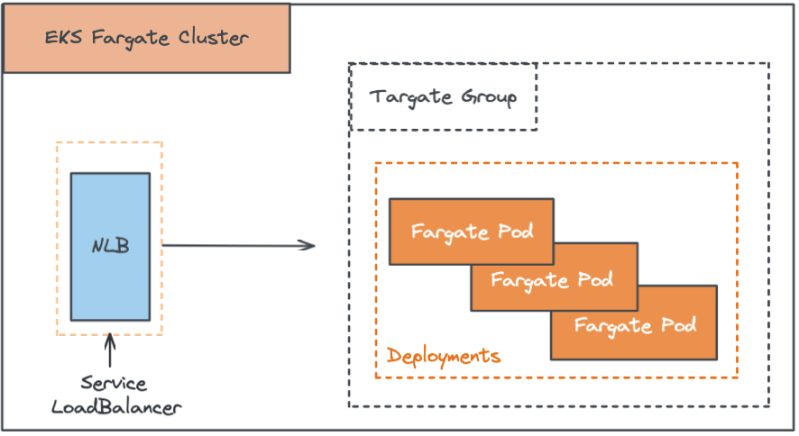
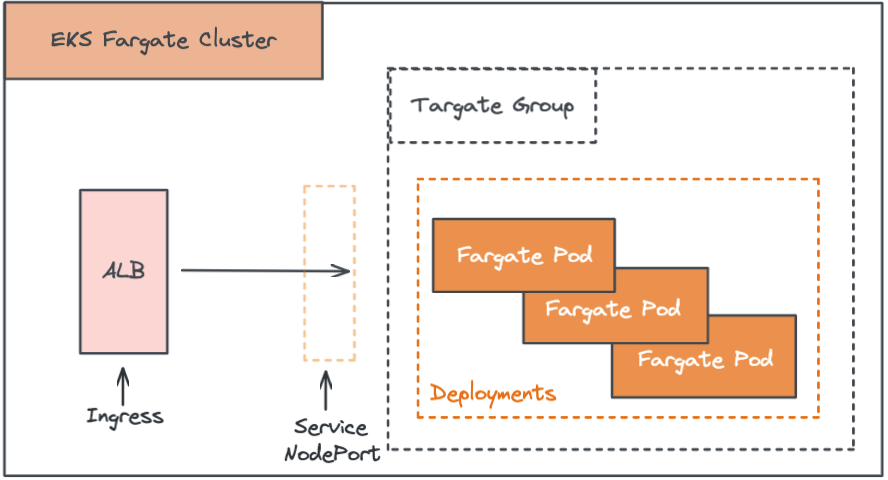

# For EKS CDK Lab.

### Example 1: kubernetes service `Load balancer` type use NLB.

[detail click here](https://github.com/neilkuan/eks-fargate-lab/blob/main/src/nlb-service-lab.ts)
To Use.
```ts
new NlbServiceLabConstruct(this, 'NlbServiceLab', {
      eksFargateCluster: cluster,
});
```

### Example 2: alb -> fargate.

[detail click here](https://github.com/neilkuan/eks-fargate-lab/blob/main/src/alb-ingress-lab.ts)
To Use.
```ts
new AlbIngressLabConstruct(this, 'AlbIngressLab', {
      eksFargateCluster: cluster,
});
```